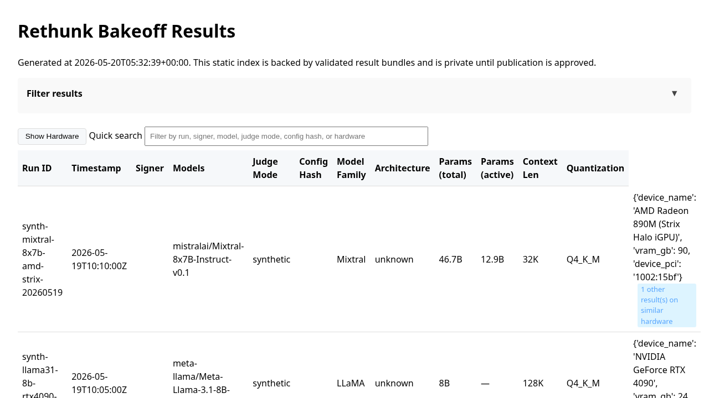

<h1 align="center">Rethunk Bakeoff Results</h1>

<div align="center">

[](https://github.com/Rethunk-AI/bakeoff-results/actions/workflows/ci.yml)
[](LICENSE)
[](pyproject.toml)

</div>

---

Private staging repository for publishing approved bakeoff result bundles from
`Rethunk-AI/bakeoff`. Bundles are validated, indexed, and published to GitHub
Pages after signer policy and release approval checks pass.



## Quick start

```sh
PYTHONPATH=src python -m bakeoff_results.validate --scan --allow-empty submissions
```

Install, build, test, and verify steps: [HUMANS.md](HUMANS.md).

## Highlights

- **Validated bundles** — structural checks, SHA256 integrity, and signer metadata on every submission under `submissions/`
- **Static leaderboard** — `build_index.py` generates `site/index.json` and a filterable HTML explorer
- **Signer policy** — `signers.yaml` allowlist trusted via signed git commits; bundle attestations use Sigstore/Rekor material when present
- **Supply-chain posture** — CI verifies bundles, attests published site artifacts, and deploys to GitHub Pages under a protected environment
- **Governed lifecycle** — accepted, superseded, disputed, revoked, incomplete, and failed states with evidence-backed moderation ([GOVERNANCE.md](GOVERNANCE.md))

## Documentation

| Doc | Audience |
| --- | --- |
| [HUMANS.md](HUMANS.md) | Validate, build, test, verify attestations, bundle schema |
| [AGENTS.md](AGENTS.md) | File layout, schema versions, submission lifecycle, CI jobs |
| [GOVERNANCE.md](GOVERNANCE.md) | Result states, signer policy, moderation standards |
| [SECURITY.md](SECURITY.md) | Vulnerability reporting, threat scope, trust bootstrap |
| [CONTRIBUTING.md](CONTRIBUTING.md) | Commits, hooks, PR process |
| [CHANGELOG.md](CHANGELOG.md) | Release notes |

## License

MIT — see [LICENSE](LICENSE). © 2026 Rethunk-AI
